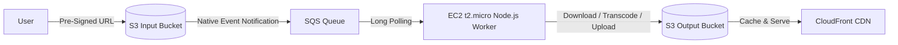

# 🎬 Free-Tier Video Transcoding Pipeline

A cost-optimized, serverless-inspired video transcoding system built entirely within the AWS Free Tier. This project demonstrates core distributed systems patterns—including queue-based load leveling, competing consumers, and event-driven architecture—using a single `t2.micro` EC2 instance running a Node.js worker.

## 🏗️ Architecture Overview

This pipeline decouples video ingestion from processing to protect limited compute resources from traffic spikes.

Core System Design Patterns
Queue-Based Load Leveling: SQS acts as a shock absorber between S3 uploads and the single-threaded Node.js worker.
Competing Consumers: The Node.js worker pulls messages via long-polling, ensuring no duplicate processing during normal operation.
Direct-to-Storage Ingestion: Clients upload directly to S3 via Pre-Signed URLs, bypassing the compute layer entirely.
Zero-Cost Networking: Uses a Public Subnet with an Internet Gateway and Gateway VPC Endpoints (S3/SQS) to avoid NAT Gateway charges.

🛠️ Tech Stack
Compute: AWS EC2 t2.micro / t3.micro (Amazon Linux 2023)
Runtime: Node.js + @aws-sdk/client-sqs, @aws-sdk/client-s3
Transcoder: FFmpeg (installed via dnf)
Orchestration: Amazon SQS (Standard Queue) + S3 Native Event Notifications
Delivery: Amazon CloudFront + S3
Process Management: systemd (auto-restart on crash/reboot)
Remote Access: AWS Systems Manager (SSM) Session Manager (No SSH/Port 22)

📂 Project Structure

/opt/transcoder/
├── worker.js          # Main Node.js polling & transcoding logic
├── package.json       # Dependencies (@aws-sdk/*)
└── .env               # Environment variables (QUEUE_URL, OUTPUT_BUCKET)

/etc/systemd/system/
└── transcoder.service # Systemd unit file for auto-restart

🚀 Quick Start
1. Infrastructure Setup
Create S3 Input/Output buckets with 2-day Lifecycle Expiration.
Create SQS Standard Queue: VisibilityTimeout=300s, ReceiveMessageWaitTime=20s.
Configure S3 Event Notification → SQS (Suffix: .mp4, .mkv, .mov).
Launch t2.micro in Public Subnet with IAM Role (S3FullAccess, SQSFullAccess, SSMManagedInstanceCore).
2. Node.js Worker Installation
Connect via SSM Session Manager:

# Install dependencies
sudo dnf install -y ffmpeg nodejs npm git
cd /opt/transcoder
npm init -y
npm install @aws-sdk/client-sqs @aws-sdk/client-s3 dotenv

# Create swap space (CRITICAL for FFmpeg memory spikes)
sudo dd if=/dev/zero of=/swapfile bs=128M count=16
sudo chmod 600 /swapfile && sudo mkswap /swapfile && sudo swapon /swapfile
echo "/swapfile swap swap defaults 0 0" | sudo tee -a /etc/fstab

3. Run as Systemd Service

sudo systemctl enable transcoder.service
sudo systemctl start transcoder.service

Monitor logs:
sudo journalctl -u transcoder.service -f
